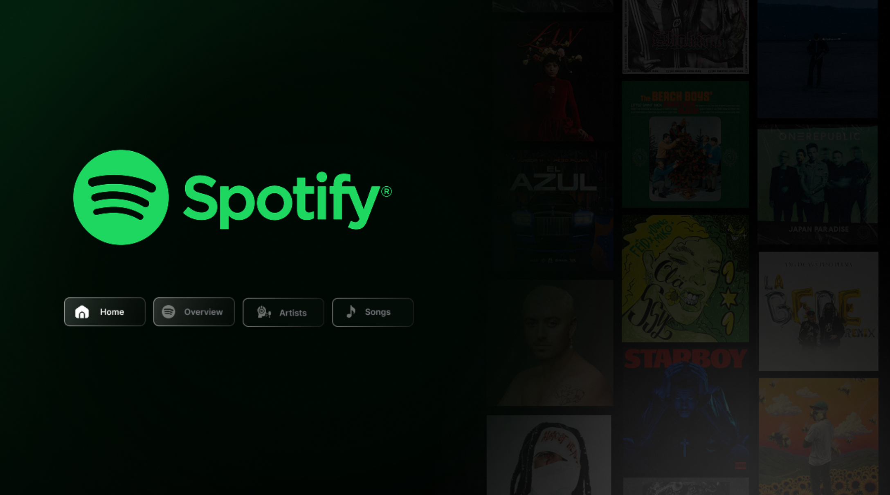
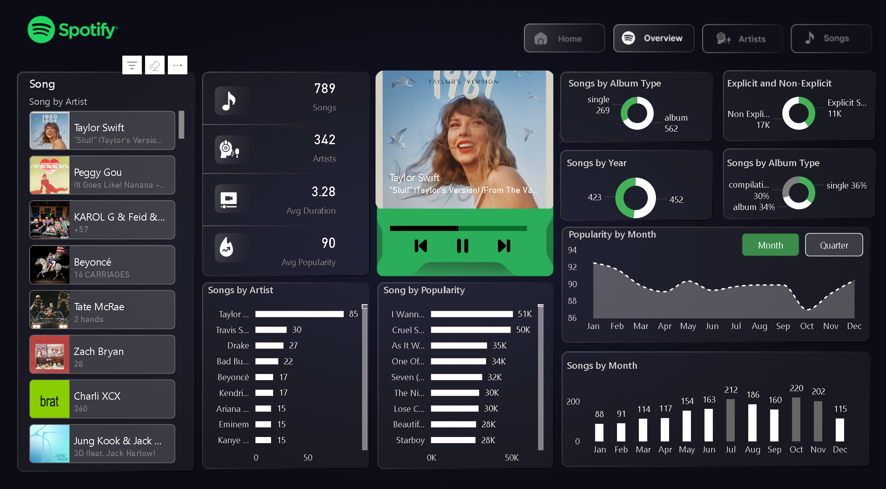
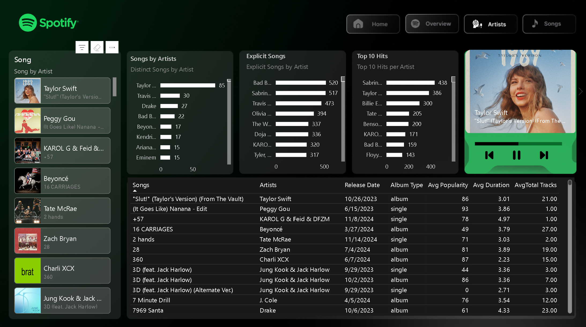
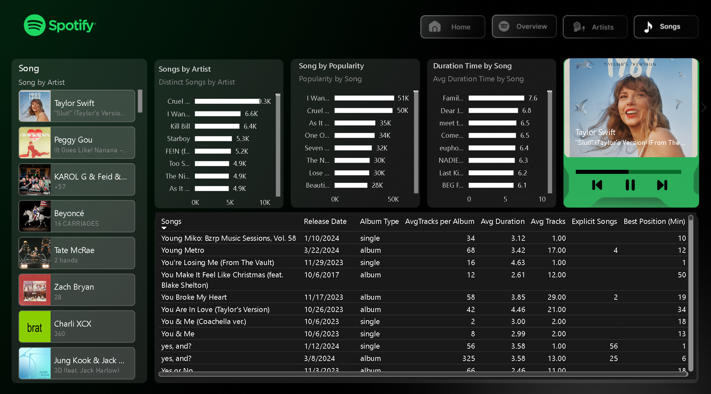

# 🎧 Spotify Data Analytics Dashboard – Power BI Project

## 📌 Project Overview
This project presents an **interactive Power BI dashboard** designed to analyze and visualize global Spotify music trends.  
It explores how songs, artists, albums, and listener preferences evolve over time — transforming raw data into **clear, actionable insights** that can help drive **business and content strategy decisions** in the music and entertainment industry.

---

## 🎯 Objective
To use data visualization and analytics to uncover:
- Top-performing **artists and songs** across multiple categories.
- The influence of **album type** (single, album, compilation) on popularity.
- The balance between **explicit vs. non-explicit** content in top hits.
- Seasonal and yearly **release trends** and how they affect engagement.

---

## 🧠 Key Insights
- **Taylor Swift**, **Drake**, and **Bad Bunny** are consistent chart leaders across several performance metrics.  
- **June to August** records the highest song release activity — reflecting summer campaign strategies.  
- **Explicit content** shows higher engagement rates in certain genres and regions.  
- The **average track duration** has decreased over time, showing shorter and more replayable content.  
- **Albums** maintain long-term popularity, indicating sustained audience loyalty.

---

## ⚙️ Tools & Techniques
- **Power BI Desktop** for dashboard development.  
- **Power Query** for data cleaning and transformation.  
- **DAX (Data Analysis Expressions)** for calculated measures including:
  - Average Popularity  
  - Average Duration (mins)  
  - Total Tracks per Album  
  - Distinct Songs per Artist  
- Custom **Spotify-inspired UI design** with consistent color palette and icons.

---

## 🖥️ Dashboard Pages
### 🏠 Home
Clean and minimal landing page with navigation buttons for user-friendly access.

### 📊 Overview
Displays total songs, average popularity, duration, album breakdowns, and monthly trends.

### 🎤 Artists
Shows distinct songs per artist, top 10 hits, and explicit song analysis — highlighting artist consistency and content style.

### 🎶 Songs
Focuses on song-level analytics: popularity scores, duration, and best chart positions.

---

## 🚀 Business Benefits
This dashboard provides actionable insights for:
- **Marketing teams** – to identify the best release windows and optimize campaign timing.  
- **Record labels** – to analyze artist performance and market trends.  
- **Data analysts** – to visualize user engagement metrics effectively.  
- **Spotify & streaming platforms** – to make **data-driven decisions** on promotion and content placement.

---

## 🧩 Future Enhancements
- Live integration with the **Spotify API** for automatic data refresh.  
- Add **sentiment analysis** of lyrics using NLP.  
- Predictive model to forecast **song success**.  
- Regional breakdown dashboards (continent/country-level analytics).

---

## 📸 Dashboard Preview
| Home | Overview | Artists | Songs |
|:----:|:----:|:----:|:----:|
|  |  |  |  |

---

## 📂 File Details
- **File Type:** Power BI (.pbix)  
- **Data Source:** Spotify Global Top 50 Dataset  
- **Created By:** Sidhant Chaudhary  
- **Tools Used:** Microsoft Power BI, DAX, Power Query

---

## 🏷️ Tags
`#PowerBI` `#Spotify` `#DataAnalytics` `#DataVisualization` `#DashboardDesign`  
`#BusinessIntelligence` `#DataStorytelling` `#MusicAnalytics` `#DataDrivenInsights`

---

### ⭐ If you liked this project, give it a star on GitHub!
